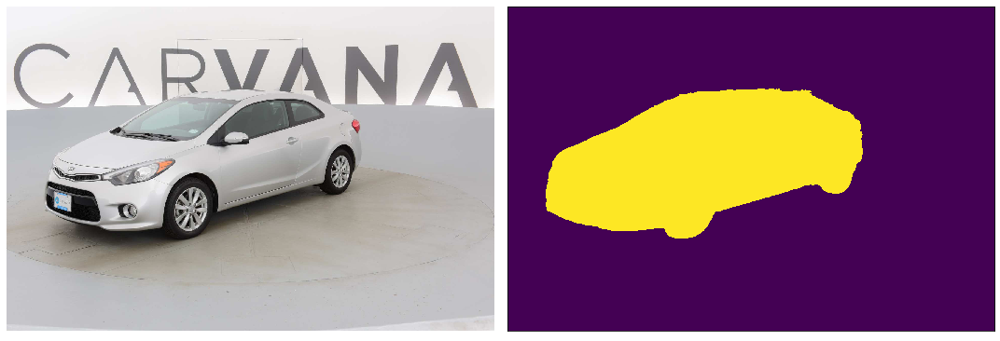

[pytorch-lightning](https://github.com/williamFalcon/pytorch-lightning) version of [Unet](https://arxiv.org/abs/1505.04597).





## Train

+ Put your dataset in `dataset/{dataset_name}`:
    + `train`: contains image names (eg `001.jpg`)
    + `train_masks`: contains image masks (eg `001_mask.tif`)

+ Sample with [carvana](https://www.kaggle.com/c/carvana-image-masking-challenge) dataset:

```
python train.py --dataset carvana --n_channels 3
```

Log and checkpoints are automatically saved in `lightning_logs`.
Early stopping is enable by default by pytorch-lightning.


## Test

+ Sample with `carvana` dataset:

```
python test.py --checkpoint lightning_logs/version_0/checkpoints/_ckpt_epoch_1.ckpt --img_dir dataset/carvana/test --out_dir result/carvana
```

## Reference

+ Implementation is heavily referred from [milesial](https://github.com/milesial/Pytorch-UNet)
